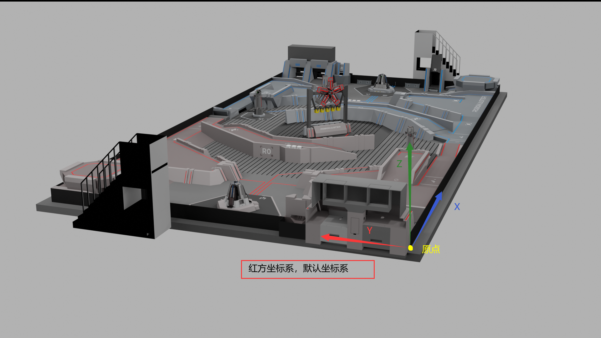
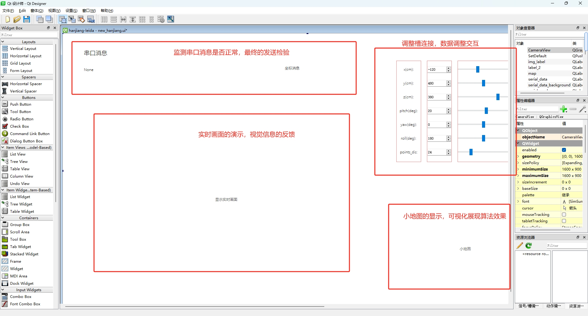

# 深圳技术大学悍匠战队2023赛季雷达

>开发者：悍匠视觉组成员——许咏琪 <br>
>部分指导：悍匠视觉组组长——栗明贤 <br>
>分类模型：悍匠前赛季视觉组成员——李彦宽 <br>
>v1.5版前的外观建模和3D打印：许咏琪 <br>
>v1.5版后两任务移交：悍匠机械组成员——洪俊钦 <br>
>文档编写：许咏琪 <br>
>适用范围：2023赛季——？ <br>
>文档编写起止时间：2023.7.14-2023.10.26 <br>
>当前版本：v2.5

## 首先声明

#### 关于知识产权

本文遵循 [CC BY-NC-SA 2.5 CN](https://creativecommons.org/licenses/by-nc-sa/2.5/cn/) （知识共享协议），具体如下图

</img>

#### 其他与本文相关重要文档手册链接：

- [RM2023超级对抗赛规则手册V1.2](./doc/RM2023超级对抗赛规则手册V1.2.pdf)
- [RM2023高校系列赛机器人制作规范手册V1.1](./doc/RM2023高校系列赛机器人制作规范手册V1.1.pdf)
- [RM裁判系统串口协议附录V1.4](./doc/RM裁判系统串口协议附录V1.4.pdf)
- [RM裁判系统用户手册V1.3](./doc/RM裁判系统用户手册V1.3.pdf)

## 跳转目录

- [介绍](#介绍)<br>
- [环境配置](#环境配置)<br>
    - [部署](#部署)<br>
    - [开发](#开发)<br>
- [文件目录结构](#文件目录结构)<br>
    - [整体工程概注](#整体工程概注)
    - [重点代码与文件](#重点代码与文件)
- [技术积累与算法](#技术积累与算法)<br>
    - [算法](#算法)
        - [投影算法](#投影算法)
        - [坐标转换](#坐标转换)
        - [目标检测追踪识别](#目标检测追踪识别)
- [主干逻辑与程序流程](#逻辑与流程)
    - [程序流程](#程序流程)
    - [主干逻辑代码](#主干逻辑代码)
- [赛季总结](#赛季总结)<br>
    - [与赛季规划的实际差距](#与赛季规划的实际差距)
    - [产生差距的原因](#产生差距的原因)
    - [规则解读和兵种需求分析](#规则解读和兵种需求分析)

## 介绍
本雷达采用纯视觉解算算法，采用双海康工业相机对准关键区域，进行图形学解算，将相机二维画面投射到虚拟的三维映射空间中（其中设计大量坐标系转换），因此目标监测和识别结果将通过这个映射关系获得裁判系统所需的三维坐标，并通过串口发送，至此完成一轮算法周期。

- 所用到的技术和理论：OpenCV，相机光学，qt界面设计，数据集的预处理，目标检测算法的训练和推理调参，串口通讯

- 关于算法，图形学三维转换和坐标系转换部分是该工程的主要研究部分，是数据处理的下游和初始化部分，然后上游是目标检测和识别的处理，而目标检测和识别算法目前已经很火，网上已经有很多成熟的训练和推理yolov5教程，具体可在b站或CSDN搜索相关教程。

- 关于测试，由于雷达测试条件很苛刻，所以在这里我是用blender这个3d建模软件（如下图），通过尽可能地调整成比赛环境来模拟，仿真的blender工程文件我放在[百度网盘](https://pan.baidu.com/s/1dDjNaOps8kBpooOBCnM-_Q?pwd=qja9)上。然后在此基础上做一个光追渲染的动画，将小车的运动渲染成视频导出，然后基于视频做调试，参数调整之类。

<div align="center">
 
<br>
图（blender仿真工程界面）
</div>
<br>

- 关于二次开发，由于blender其实并不适合做仿真环境（本质是做设计，影视和动画的工业软件，依赖后期渲染），所以后续可能会考虑用UE或者Unity这些游戏引擎来做仿真引擎更加符合需求（实时渲染和机制设定）。然后就是每个算法周期的性能高度依赖于目标检测算法的推理速度，所以后续应该会不断更新目标检测的算法，使之更快和性能开销更低。

## 环境配置
开发平台为Windows11，基于python开发，pytorch的yolov5框架，所以需要在Windows下安装python和pytorch的gpu版本，再安装cuda，然后在终端pip安装所有用到的第三方库。

建议部署在中高性能的游戏本上，一个是因为yolov5需要高性能的显卡进行推理，二是为了便携以方便比赛前的准备和比赛时时的布置。这里开发者采用的是CPU为i5 11400H，GPU为RTX 3060，内存为16GB大小的游戏本，运行帧率大概在40-50FPS。

#### <div id="部署"></div>如果单纯是部署运行，则具体步骤如下：

1. 安装python3.8或以上，单独安装cuda_11.0,<br>`./torch-1.7.1+cu110-cp38-cp38-win_amd64.whl`,<br>`./torchvision-0.8.2+cu110-cp38-cp38-win_amd64.whl`，<br>这三个我都放在百度网盘中：[cuda-11.0](https://pan.baidu.com/s/1LSHlWMMSNM4RKag0VI8GmQ?pwd=dt38) ，[torch-1.7.1](https://pan.baidu.com/s/13H1zv93IP6blQZIZQcBnWg?pwd=b566) 和 [torchvision-0.8.2](https://pan.baidu.com/s/1MIAymG-uJrRqLPa6ttnC4A?pwd=jk37)，除了cuda，其他是该文件目录下打开终端，然后执行`pip install [此处替换为以上高亮内容]`，以上有两个包，所以替换两次，如`pip install ./torch-1.7.1+cu110-cp38-cp38-win_amd64.whl`

2. 安装完后，在powershell或者cmd中运行`pip install -r requirements.txt`安装所有第三方依赖，建议用魔法科学上网，可以更快完成。

3. 在工程目录下(`./hanjiang-leida/`)下，打开终端执行`python launch.py`即可运行雷达程序

4. 然后会弹出一个调参的界面，通过观察实时画面的点云，来对相机外参进行调参（如下图所示），接着调整界面右侧的相机外参即可移动点云，调整至与场地匹配即可。

<div align="center">
 
<br>
图（雷达运行后的调参界面）
</div>
<br>

#### <div id="开发"></div>如果是作为开发，则具体步骤如下：

- **在完成部署步骤的基础上开始！！**

1. 建议使用PyCharmIDE或者配置完python环境插件VSCode进行开发。所以可以根据他们各自的优缺点进行取舍(PyCharm功能全，配置工程简单，但是启动慢，占用内存大，VSCode轻量化，启动快，但是配置杂)，二选其一或者都进行安装。

2. 在工程目录下打开为项目，VSCode打开为工作区，然后建议使用git进行代码管理。

3. 在进行修改和二次开发前请务必熟读文档，熟读后和上网搜索解决不了的问题再发邮件询问开发者

- 代码逻辑：
    - 主函数在`launch.py`，然后用多线程分别启动目标检测线程，主干算法线程，界面线程和串口线程
    - 若按模块划分，则分为qt界面模块，日志模块，yolov5模块，串口收发模块，装甲板识别模块和图形学转换模块（详细见文件目录结构）

- 附: 建议通过修改注册表等能彻底关闭Windows更新的方法防止紧急情况时更新

## 文件目录结构

注：
- 其中很多文件夹里都有`__pycache__`文件夹，这是python运行后的缓存文件，已经添加在.gitignore了，不用管。
- ./前缀的为文件夹，否则为文件，用... ...代替的是不重要的文件，都是一些临时测试的文件
- 如果是通过git clone的没有./res目录下的视频资源，请点这里[百度网盘下载](https://pan.baidu.com/s/1QX-9IK-TDzhJDhOQn4JQpQ?pwd=v9my)

### 整体工程概注
```
├─./.idea----pycharm配置文件，忽略
│  └─inspectionProfiles
├─./.vscode----vscode配置文件，忽略
├─./deep_sort_pytorch----deepsort目标追踪算法的文件夹，对追踪有更高要求时调参时再看
│  ├─./config----主要调参的就是其中的deep_sort.yaml文件，具体参数调整教程可以搜关于deepsort调参的CSDN
│  ├─./deep_sort
│  │  ├─./deep
│  │  ... ...
├─./doc----放置文档的资源文件夹
├─./example----open3d测试激光雷达点云的文件夹
├─./log----日志文件夹
│  └─./serial_log----串口收发日志
│     └─ ... ...
├─./models----yolo模型配置文件夹，可不管，但被pytorch隐性调用，不可删
│  └─ ... ...
├─./output----deepsort输出文件夹，可不管，可删
├─./res----第一个重点文件夹！！！存放测试资源文件夹
│  ├─./3D-models----场地点云和网格模型（论坛找的）
│  ├─./exp21----exp前缀的文件夹均是在yolo推理的输出文件，拿来测试用
│  │  └─./labels----存放输出的检测框的标签和坐标的txt文件夹
│  ├─./exp22
│  │  └─./labels
│  ├─./exp31
│  │  └─./labels
│  ├─./exp33
│  │  └─./labels
│  ├─./mask----先前在v1.5版用作生成场地高低差的点云遮罩
│  ├─./maskv2----v2版本后的遮罩
│  ├─./o3Ddata----open3d测试的配置文件
│  │  ├─./DepthCamera_JSON
│  │  ├─./DepthCapture_PNG
│  │  ├─./RenderOption_JSON
│  │  ├─./ScreenCamera_JSON
│  │  └─./ScreenCamera_PNG
│  ├─./true_location----blender脚本导出的车辆每一帧位置的数据
│  ├─./video_left----blender内左相机（仿真小相机）的yolo输出
│  │  └─./labels
│  ├─./video_right----blender内右相机的yolo输出
│  │  └─./labels
│  ├─1080P5min.mp4----小工业相机blender仿真测试视频
│  ├─left.mp4----海康左相机blender仿真测试视频
│  ├─right.mp4----海康右相机blender仿真测试视频
│  ├─hiv_left1.avi----海康左相机长沙比赛录制视频1
│  ├─hiv_left2.avi----海康左相机长沙比赛录制视频2
│  ├─hiv_right1.avi----海康右相机长沙比赛录制视频1
│  ├─hiv_right2.avi----海康右相机长沙比赛录制视频2
│  ├─new_ui.png----调参界面gui背景图
│  ├─rm2023_map.png----调参界面的平面地图
│  └─ ... ...
├─./src----第二个重点文件夹！！！存放主要算法代码（具体解析看算法一栏）
│  ├─./cv_utils----坐标系转换，维度映射，建图
│  ├─./myserial----串口通讯相关的代码
│  ├─./qt----调参界面设计与各版迭代
├─./test----带jupyter notebook文件，有时写一些测试代码用，其中有用到Open3d库
├─./utils----完整的yolo的工具包
├─./weights----权重（放置yolov5.5训练的模型）文件
├─./yolo----简化的yolo包，可不管，暂时弃用
├─./yolov5----v1前用的目标检测，暂时弃用
├─launch.py----启动主函数的代码文件 
├─arguments.py----启动参数文件（重要文件！！！）
├─Solution.py----主干算法周期（重要文件！！！）,其中包含v1和v2版本，以类名做区分了
├─track.py----deepsort目标追踪代码的主函数，被Sulution调用
├─detect.py----yolov5目标检测代码主函数，被launch以多线程启动
├─modelv4.py----装甲板识别的神经网络结构类的定义，被pytorch隐性调用
├─requirements.txt----记录pip安装第三方依赖的文本文件
├─.gitignore----git忽略管理的文件/文件夹
... ...
```
### 重点代码与文件

`./src`底下的文件为重点，其中为各个功能和算法的核心代码

1. └─`./cv_utils`----坐标系转换，维度映射，建图
```
├─build3D.py----生成三维场地点云，保存为*.npy文件
├─drawMap.py----绘制相同场地高度的实心轮廓，并保存为二值遮罩图（环高轮廓，梯形高地，飞坡道，停机坪，大符点）
├─projectPoints.py----投影算法，即坐标系转换和二维到三维的映射算法
├─solvePNP.py----PNP算法测距，输入内参与现实三维点，输出外参
├─*.npy----建图点云数据(np.float32)
```

2. └─`./myserial`----串口通讯相关的代码
```
├─Serial.py----寻找USB转TTL设备的串口号，串口类的收发方法
```

3. └─`./qt`----调参界面设计与各版迭代
```
├─hj_ui*.py----修改的第*板qt设计器生成的ui代码
├─ui.py----调用ui代码，将实时画面显示到调参界面，并将调整的参数通过槽函数连到后端
├─hangjiang.ui----联调前最新的ui设计文件
├─new_hangjiang.ui----联调后的ui设计文件
```

工作目录下的主要代码文件
```
├─launch.py----启动主函数的代码文件 
├─arguments.py----启动参数文件
├─Solution.py----主干算法周期,其中包含v1和v2版本，以类名做区分
├─track.py----deepsort目标追踪代码的主函数，被Sulution调用
├─detect.py----yolov5目标检测代码主函数，被launch以多线程启动
├─modelv4.py----装甲板识别的神经网络结构类的定义，被pytorch隐性调用
```

## 技术积累与算法

如果想了解子功能/算法的运行原理，如投影解算，坐标系转换，串口通讯，在这一栏是主要内容。对于想要二次开发的，在了解了以下算法后还需要关注以下算法在整个流程消耗的时间，再来权衡要加的功能，或者进一步优化。

如果想了解骨干的运行逻辑，程序流程，每一轮算法周期各个时刻会处理什么，而不是每个具体实现的原理，那么请移步到下一栏。

### 算法


1. #### 投影算法

最关键的算法就是获取二维转三维（重要）的映射方法，位于`./src/cv_utils/projectPoints.py`的`Maper`类下的`get_points_map`方法，处理完参数后调用了`OpenCV`的`projectPoints`函数去解算在相机坐标系下的点云投影在像素坐标系 

整个解算需要的参数就是相机的外参（如果不懂相机内外参建议直接跳转到[教程链接](#教程链接)，这里还要有点相机光学基础），所以要注意在`argument.py`中有关内参参数的调整，以应对所用到的不同的相机。

在此关于内参的参数有6个：
1. 第一个是`Focal_Length`（焦距，单位m），在这个文件中有两套相机的内参，一个是小相机的，一个是海康威视工业相机的，小相机的填的是`4.2e-3`，即0.004m，即4mm焦距，海康填的是`16e-3`，即16mm焦距。
2. 第二个是`Sensor_X`（传感器CMOS的横向尺寸，单位：m），在此小相机是`5.37e-3`，即5.37mm长
3. 第三个是`Sensor_Y`（传感器CMOS的纵向尺寸，单位：m），在此小相机是`4.04e-3`，即5.37mm高
4. 第四个是`Unit_Size`（像元尺寸，单位：m），在此小相机是`2.8e-6`，即2.8um
5. 第五个是`SCREEN_W`（输出画面宽，单位：像素），小相机是1080P即宽为1920，遂该值为`1920`
6. 第六个是`SCREEN_H`（输出画面高，单位：像素），小相机是1080P即高为1080，遂该值为`1080`

关于外参的参数也有6个，也在`argument.py`中，注意这个是在RM红方坐标系下（具体坐标系示意看下一子栏：[坐标转换](#坐标转换)）：
```python
Camera_X = -5.2     #X轴，左右轴，单位为米，向左为正，向右为负
Camera_Y = 3.8      #Y轴，上下轴，单位为米，向上为正，向下为负
Camera_Z = 1.4      #Z轴，前后轴，单位为米，向后为正，向前为负
Rotato_X = 20       #pitch轴，俯仰轴，角度制，平视为0度，向下为正，向上为负
Rotato_Yaw = 0      #yaw轴，偏航角，角度制，正视为0度，向左为正，向右为负
Rotato_roll = 0     #roll轴，翻滚角，角度制，正视为0度，面向前顺时针旋转为正
```

- 关于`OpenCV`的`projectPoints`函数的详细解析与说明可以上OpenCV官方文档或者CSDN看，这里只贴出参数说明（见下图）

<div align="center">
 
<br>
projectPoints函数的参数说明图
</div>
<br>

- 如果想要深入了解原理，其中涉及到的，专业方面是相机原理和计算机图形学知识，通识方面是线性代数，这里给想要了解的人推荐两个视频和一些CSDN和知乎教程

    <div id="教程链接"></div>教程链接:<br><br>

    1. [Bilibili：无所不能的矩阵 - 三维图形变换](https://www.bilibili.com/video/BV1b34y1y7nF)
    2. [Bilibili：探秘三维透视投影 - 齐次坐标的妙用](https://www.bilibili.com/video/BV1LS4y1b7xZ)
    3. [CSDN:【立体视觉】世界坐标系、相机坐标系、图像坐标系、像素坐标系之间的关系](https://blog.csdn.net/u011574296/article/details/73658560)
    4. [知乎：视图变换和投影变换矩阵的原理及推导，以及OpenGL，DirectX和Unity的对应矩阵](https://zhuanlan.zhihu.com/p/362713511)
    5. [知乎：旋转向量、旋转矩阵、欧拉角](https://zhuanlan.zhihu.com/p/401806150)

2. #### 坐标转换

另一个重要的是坐标系转换，在这个工程中涉及两组主要坐标系组（`RM组坐标系`，`投影（CV）组坐标系`），一组中有两个关联坐标系（组内坐标系的互转会相互影响，组外坐标系较独立，RM组包含`红方坐标系`和`蓝方坐标系`，CV组坐标系包含`相机坐标系`和`场地坐标系`）
- `RM坐标系组`：<br>
主要是为了将最终定位结果转为裁判系统规范而规定的一个坐标系组，因为红蓝方因为视角不同所有各有不同的坐标系（注意这个红蓝方指的是我方是红还是蓝，而不是敌方的），因此在发往裁判系统前是按这个坐标系组进行转换。
- `CV坐标系组`：<br>
CV坐标系组内为场地坐标系的和相机坐标系的，两者的坐标轴完全相反。场地下的为正OpenCV坐标系的坐标轴，跟其完全符合。相机下的为反OpenCV坐标系，跟其完全相反，这个也是在调参界面观察数值变化时需要特别留意的，如果细心就能发现这层关系。

以下四图更直观地描述了这四个坐标系





坐标系之间转换的算法位于`./src/cv_utils/projectPoints.py`文件中，转换原理非常简单，就是找出要转的坐标系的每一个轴对应的坐标系的轴就行，如下图<br><br>

<div align="center">projectPoints.py中的坐标系转换</div>

3. #### 目标检测追踪识别

    这里的算法流程是流水线性的，流程如下：一是先检测，检测出当前帧能被识别为车辆和装甲板的区域。二是追踪，对检测到的所有车辆的ROI(检测到车辆区域)进行deepsort算法绑定对象，使视频流中同一辆车在不同时刻，即使位置发生变化，但是在追踪算法的处理下，始终识别为同一个对象，即让检测后的对象在时间上产生关联。

- 检测：<br>
    在雷达中需要用到的检测是为了检测车辆于图像中的位置和装甲兵区域。在此用的是目前最火的开源目标检测项目[yolov5 5.0](https://github.com/ultralytics/yolov5)目标检测算法。在此训练的是YOLOv5s模型，迭代300次，数据集63张，类别为两个类别：车辆和装甲板，模型文件放置在weight文件夹内，这里调用的模型文件名可以在参数文件`arguments.py`中的`Yolo_Weight`字符串常量改，这里设置的是`'20230505_2cls.pt'`模型文件，命名规范为：(训练日期)_(多少个类别)cls.pt，以下为该模型的参数（即YOLOv5s）

    [assets]: https://github.com/ultralytics/yolov5/releases

    Model |size<br><sup>(pixels) |mAP<sup>val<br>0.5:0.95 |mAP<sup>test<br>0.5:0.95 |mAP<sup>val<br>0.5 |Speed<br><sup>V100 (ms) |params<br><sup>(M) |FLOPS<br><sup>640 (B)
    ---|---|---|---|---|---|---|---
    [YOLOv5s][assets]    |640  |36.7     |36.7     |55.4     |**2.0** |7.3   |17.0

    其中`arguments.py`中的`SOURCE`字符串常量指定了yolo的输入流，默认的流填的是`./res/1080P5min.mp4`这段视频。这里可以改成其他测试视频，如`hiv_left1.avi`（海康左相机长沙比赛录制视频1）。除此之外还有`Input_Size`（输入尺寸）整数常量，重塑输入流的大小（正方形），还有两个重要的参数放在了`detect.py`代码中，第一个置信度阈值`conf_thres`这里设的是`0.5`，第二个交并比阈值`iou_thres`这里设的是`0.45`。还有其他参数如果想深入了解（yolo调参），建议上CSDN或B站查看相关yolo参数教程，网上关于yolo的教程已经很多了，在此不赘述。

    训练模型的yolo代码放在别处，这里的yolo代码经过简化和输入流处部分修改，只为了推理用的。

    另外要说的是，用这个`'20230505_2cls.pt'`的YOLOv5s模型，在`Input_Size`为1280时，消耗性能在笔记本130w的3060上单次推理是12ms左右

    这个目标检测算法是日后要优化的，在此为的是同等时间下和识别精度上，争取更小的模型，更少的性能消耗


- 追踪：<br>
    实现追踪算法用到了`匈牙利算法`和`卡尔曼追踪`。这里的追踪算法用的是开源的[deep_sort_pytorch](https://github.com/ZQPei/deep_sort_pytorch)，在上一层yolo目标检测加上了追踪算法后，消耗的时间达到了45-50ms
    
    接收的输入是上一层yolo输出的所有超过设定置信度先验框（这里用一个列表代替一个先验框，里面有六个元素。第一个元素类别，用编号代替，0为车，1为装甲板。然后每一个用矩形左上角和右下角角点像素坐标表示，最后加上置信度，就共六个元素，即`[cls, x1, y1, x2, y2, conf]`），然后把所有框添加到总的列表里，这个总表就是单帧的所有先验框列表的列表。这里有个重定向到文本文件里的单帧，如下图示例

    


- 识别：<br>
    在雷达中需要的识别是为了识别车种和车的编号，和根据颜色判断检测的车属于哪一方。所以在此线性地分成两个步骤：先进行装甲板图像识别（输入为上一层图像按检测到的装甲板ROI裁切的图像，输出为装甲板编号的索引，后进行OpenCV颜色区分是红/蓝方。

    识别分类代码位于`Solution.py`文件中的`Car`类下的`getid_lyk`的方法下
    
    装甲板索引在此为：0对应未知，1-5对应1-5号装甲板，6对应哨兵)），下游发给裁判系统时这个装甲板编号会按照系统规定编号（如下图）修改

    

    这里使用的是上赛季视觉队员李彦宽的设计一个卷积网络，pytorch模型，能对二值化后的装甲板ROI做图像分类，模型放在`./weights/`下，文件名为`2023_4_9_hj_nmu_3.pt`，此模型有筛选识别差的模型，并有识别哨兵装甲板。在此目录底下还有一个手写数字识别的模型`Minist_1_5.h5`，这个模型是`keras`模型，只识别1-5的纯数字，也就不包含哨兵装甲板。两者都只对于正面的数字识别效果好，对斜向的装甲板大部分都是错的，所以在此加了层CV仿射变换的处理，检测斜向的然后纠正为正向的。

    输入大小：（26，30）（数字/图像）二值图，输出车辆编号，累加进目标对象识别统计表中。

    目前这部分效果不好，对数字装甲板识别在暗光下大概率错（场地灯光条件远不如仿真中的，有其他移动射灯的干扰），图像装甲板基本都错，这个是必修的。推测原因应该是视觉部分阈值处理很看场地灯光条件，后续修改应该改大模型版，或者就是直接yolo，但又需要平衡性能消耗了


4.  #### 界面设计

    这里的界面设计用到了pyqt5的第三方库（所以需要先了解pyqt5界面开发再来往下读）。注意这里的界面设计是为了调参更加直观，所以优先考虑的是实用性和直观性，其次再考虑美观性或者甚至不考虑美观性。

    需求如下：<br>
    1. 上场需要校准相机的外参，共6个参数，通过调整算法中相机在RM坐标系底下，离原点的三个轴的偏移量来使其前后，左右，上下移动，这是前三个参数。然后还要调整算法中相机的欧拉角（俯仰，偏航，翻滚）来调整相机的朝向，这是后三个参数。所以，需要有一个参数面板和调整工具来对应调整。
    2. 调整需要有反馈，需要知道调参后的效果，所以这里还需要有监视器，去反馈算法中相机在当前位姿下的投影场地点云的实施效果（与真实相机中场地的重合度），所以有一个显示实时画面的界面。
    3. 还有要查看下游算法的输出效果，则需要有动态的数据监视窗来查看要上传裁判系统的信息，同时也要有对输出效果的反馈，如对于定位则需要有小地图来显示定位到的车辆信息。
    4. 需要有些功能需要便捷触发，如重置参数，一键发送，开关视效等功能，需要安排界面上的按钮
    <br><br>

    </img>
    <div align="center">qt设计时的需求分析</div>
    <br>

    > 界面采用迭代开发的方式，每一版的设计流程大致如下：<br>

    <b>核心是先分析需求，想好需要的功能</b>

    前端：
    - 考虑哪些参数需要动态调整的，会在界面上安排调整的工具，如按钮，滑块，输入框等
    - 考虑界面排布，相关联的放在同一框内
    - 考虑重要程度和直观程度，调整框与框之间的相对大小比例和绝对大小
    - 考虑数据的重要程度，安排数据间的相对位置

        然后用qt-designer设计器设计ui，导出ui文件，在用pyqt5小工具用ui文件生成界面代码文件。更详细的教程点击这里：
        
        [Python 小白从零开始 PyQt5 项目实战（8）汇总篇（完整例程）](https://blog.csdn.net/youcans/article/details/120925109)

    后端：
    - 考虑数据传输，编写需要用到的功能的后端接口
    - 处理异常情况，防止界面卡死

        修改界面代码文件，在该文件中编写对应的功能接口和数据接口。
    </img>
    <div align="center">./src/qt/ui.py中对应的相机参数调整的数据接口</div>

    
### 逻辑与流程

#### 程序流程

&ensp;&ensp;先来看看程序流程图

</img>
<div align="center">launch.py和Solution.py两个主要代码的流程图</div>

#### 主干逻辑代码
> 如果理解了整个逻辑，那么很显然能发现，整个算法周期的各个算法的接口的调用主程序，全部位于Solution.py之中

代码大纲（具体接口文档看代码文件，在此仅简单说明）：
```python
class car 
    """车辆对象
        
        其一存储了车种，车色，车位置三大信息，
        其二包含识别装甲板接口，获取装甲板颜色接口，获取车辆位置接口，三大接口
    """
    def __init__
        self.bbox = bbox            # yolo 识别框（先验框）
        self.serial_id = 0          # 车种在裁判系统串口的识别id

        self.color = 'unknow'       # 车辆装甲板颜色（敌我）
        self.armor = [0, 0, 0, 0, 0, 0, 0, 0, 0]     # 装甲板识别统计
        self.pos = []               # 车辆实时位置
        self.live = 5               # 对象丢失生命周期

    def getid_minist        # 输入到 Minist手写数字模型中获取装甲板id
        ···
    def getid_lyk           # 输入到李彦宽的装甲板识别模型中获取装甲板id
        ···
    def getColor            # 通过传统视觉，获取该车装甲板灯条的颜色，为了区分红蓝方
        ···
    def cut_num             # 在YOLO识别出装甲板的ROI基础上切出装甲板上的数字/图像
        ···                 # 把二值图数字周围多余的白色区域裁剪掉

# 全局方法
def IsEnemy             # 返回是否敌方的布尔值
    ···
def IsINbbox            # 判断该装甲板是否在车的识别框内
    ···
def drawFPS             # 绘制监视器左上角帧数信息
    ···

class Camera
"""虚拟相机对象

    用于校准对应现实中相机于初始坐标系中的位姿，后续图形学解算车辆实时位置所需
    包含一个魔法方法（运算符重载），用于判断位姿是否改变
"""
    def __init__        # 初始化相机，包含6个自由度（x，y，z，pitch，roll，yaw）
        ···
    def __eq__          # 重载相等运算符，用于判断位姿是否改变
        ···

# 重点：主干逻辑（解决方案），相当于雷达程序主函数
class Solutionv2
"""第二版本的程序主干（当前）

    包含三大算法层和一个调节算法层逻辑的主函数
    第一个算法层是yolo检测识别追踪一体算法层
    第二个算法层是装甲板识别图像处理算法层
    第三个算法层是图形学解算层
"""
    def __init__ # 初始设置，包含模型加载和实时被识别车对象
        self.exit_flag = -1     # 退出参数，用于指导所有算法层停止（目前只在第一个算法层）

        # 加载李彦宽的装甲板识别模型
        self.armor_lyk_model = torch.load('weights/2023_4_9_hj_num_3.pt').cpu()
        self.armor_lyk_model.eval()

        # 加载数字识别模型（后续因识别度低被废）
        # self.armor_minist_model = load_model("weights/Minist_1_5.h5")
        # self.device = torch.device("cuda" if torch.cuda.is_available() else "cpu")

        self.device = torch.device("cpu")       # 设置推理设备，这里用CPU做装甲板识别
        self.car_dict = {}                      # 车对象的字典

        self.car_bboxs = []                     # 接收第一个算法层的输出
        self.setlive = 5                        # 设置车对象生命周期

    def yolo_deepsort_layer  # 第一层算法层：YOLO（检测） 和 DEEPSORT （追踪）层，输出车二维位置

    def armor_color_layer    # 第二层算法层：装甲板识别颜色，区分敌我，获取id层

    def project_layer        # 旧第三层算法层（已弃用）：图形学解算层（二维转三维），输出真实坐标

    def new_project_layer    # 新第三层算法层：新图形学解算层，哈希法，

    # 到第三层最终输出车id和位置的直达裁判系统串口的信息

    def backbone             # 程序骨干主函数，大循环在此

    def Exit                 # 退出方法，用于终止yolo

# 第一版主干逻辑（解决方案），联调期间，已弃用
# 对比第二版，有检测而无追踪，直接使用检测模型识别装甲板（识别率低），解算位置用碰撞法，效率低
class Solutionv1
    def deal_yolo_out        # yolo 输出，分出装甲板id和先验框
        ···
    def map_pos              # 碰撞法检测实时位置
        ···
    ··· # 其他不重要，省略
```

## 赛季总结

### 与赛季规划的实际差距：
差距主要有这些：激光雷达和相机选型，算法的速度和优化程度，实际功能的重要性。如果细分，就主要分为一下两个对立的方面：

1. 优秀方面：
- 原本的赛季规划是采用`双目视差测距法`的定位算法，实际被抛弃，换作精度更高，更容易调参的`单目解算投影法`。起初投影法消耗的运算资源更多，所以和双目算法之间也是各有优劣，但是后来投影算法经过视觉算法将位置信息融入图像后，时间复杂度变成O1，算法速度上也超过了双目算法，所以后来实际便全面倒向投影算法。
- 原本的赛季规划是采用单个相机对着全场，挑选的相机需要大的视野才能覆盖全场，根据相机光学原理，需要的是`短焦`的相机才能有足够的视场角覆盖，但是后来在组长提出说，比赛场地内曝光很不均匀，成像质量会很差，极大影响装甲板的识别。因此实际改成两个较长焦的较大画幅的`海康工业相机`对准关键区域。最终也是取得了更好的效果。
- 原本的赛季规划的`调参gui`在实际的测试中偏小，导致看不清实时画面中的车种信息，同时可视化的视觉特效在小比例的gui下对画面造成了`太多遮挡`，所以后面实际把调参的gui做到几乎覆盖全屏的大小，以便使视觉可视化产生的遮挡最小化。同时信息也更明显。

2. 不足方面：
- 原本的赛季规划是采用 `Livox Mid70` 的激光雷达进行积分建图的，这种雷达属于`固态积分式`的激光雷达，更适合大面积的三维点云。但是实际是购买了`机械扫描式`的激光雷达，虽然速度快，但是点云稀疏，其16线的扫描导致在超过半场的时候两线之间的扫描间隙足以融入一辆车，并且点云很不直观，在实际战场上根本达不到要求。
- 原本的赛季规划是达到完全的串口通信功能，但是实际的只有发送的完成了，接收的只有日志功能，并没有解析接收信息。所以并`没有对接收信息有任何处理`就存入日志。所以实际上完成的串口功能不对称。接收上需要`补充解析，反馈，调整`等功能。
- 原本的赛季规划是整个`部署简单化，快速简洁`，但是后来才发现远远低估了整个工程的代码量，要维护的`功能很多且线性化`，其中任何一环的问题都会导致单个算法周期无法完成。所以后面实际在部署时需要多个检测步骤，并且后续添加的传感器太多，没有提前对接线时间进行考虑和规划，导致最终比赛时3分钟调试时间并不够完成全过程全功能的部署。

### 产生差距的原因
原因是多个方面并且`前后相互影响`的，做得好的没什么好说的，是因为做得好的投入了很多精力，所以在这里只说不足方面：

1. 因为雷达`算法流水线长`，过程复杂，每一个新流程前后相互影响，经常有大量优化的空间，所以工作量比较大，并且每个方案的延申不同，需要`平衡取舍`，在各个方案下来回调转，不断调整，往往是每一种方案都要优化，最终采取哪一种算法不确定性很大。而且这样导致无法完成所需要的全部子功能。

2. 对下游的算法缺乏充分的考量，导致经常上游算法做完后需要重构下游算法，`考虑现实的因素不够多`，其实就是对比赛规则或者比赛场地不熟悉导致的。

3. 激光雷达缺货导致原本的采购方案`被打乱`，没有备选方案导致在时间较紧时对新的采购方案缺乏调查。导致花大价钱却买来不适合需求的型号。其实就是缺乏意外考虑方案。

### 规则解读和兵种需求分析

- 规则解读：<br>
现在这个版本的规则是雷达`完全取消了操作间`，也就是全面转入自动化运行，就如今年的哨兵也转向更自动化的机器人方向。从中可以看出官方对车种的技术要求越来越高，对技术积累的越来越重要。

- 兵种需求分析：<br>
雷达需要在比赛过程中`自动化发送敌方实时坐标`和`关键区域的预警信息`，由于需要自动化，所以需要通过`神经网络的目标检测，目标追踪和目标识别算法`，去满足自动化处理的前提需要。然后通过裁判系统串口通讯走`雷达机制`，在符合精度判定的情况下实时位置便会正确同步给云台手。

但说实话，我感觉在当前版本下，雷达所发挥的战场功能并无太大作用，地位没其他车组重要，或者是我方操作手对地图信息的掌握运用能力还不够高，所以要么等待规则改动，要么提升操作手观察地图的能力，可能重要性就慢慢提升上来了。

